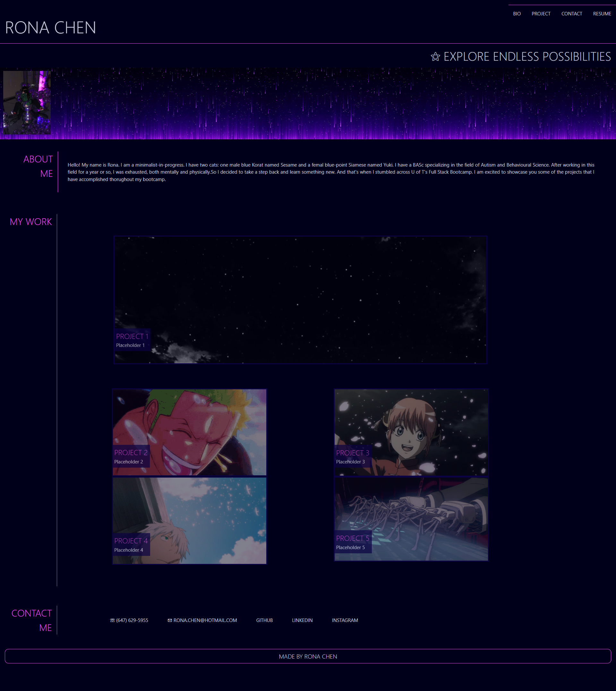

# Rona Chen's Portfolio Website

## Table of Contents

- [Description](#description)
- [Visuals](#visuals)
- [Deployed Webpage](#deployed-webpage)
- [Installation](#installation)
- [Credits](#credits)
- [License](#license)

 

## Description

The objective of establishing this repository is to construct a personalized portfolio website that introduces oneself and showcases accomplished projects. This initiative serves as an efficacious method for potential employers to acquire a comprehensive understanding of one's competencies.

Note: Due to an insufficient number of completed projects to showcase, placeholder images have been utilized in the project section of the webpage.

 

### The webpage has...
- Glowing navigation and contact menu when hovered
- Navigation and contact menu changes colour when active
- Navigation bar take users to the specified sections within the webpage
- Contact menu redirect users to external links when selected
- Project image changes opacity when hovered
- Project image redirect users to external sources when selected
- Glowing footer when hovered

## Visuals

This is a screenshot of the webpage:

 

## Deployed Webpage

https://ronachen99.github.io/rona-chen-portfolio/

 

## Installation

N/A

 

## Credits

N/A

 

## License

Please refer to the license document at: https://github.com/ronachen99/rona-chen-portfolio/blob/main/LICENSE